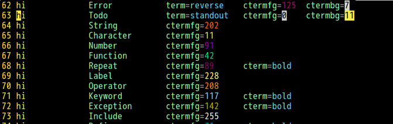
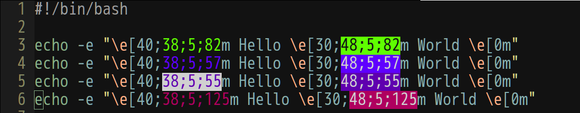
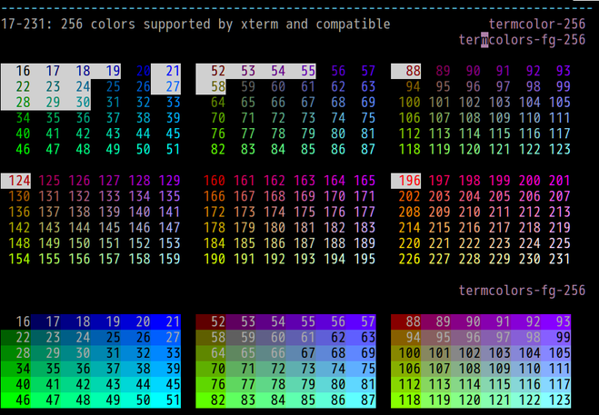

# termcolors.vim
Highlight terminal color codes with the color they represent.

## Installation

With [pathogen](https://github.com/tpope/vim-pathogen):

```sh
cd ~/.vim/bundle
git clone https://github.com/kba/termcolors.vim
```

With [Vundle](https://github.com/VundleVim/Vundle.vim), add to your `.vimrc`:

```vim
Plugin 'kba/termcolors.vim'
```

## Supported file types

### vim



### sh



### help


